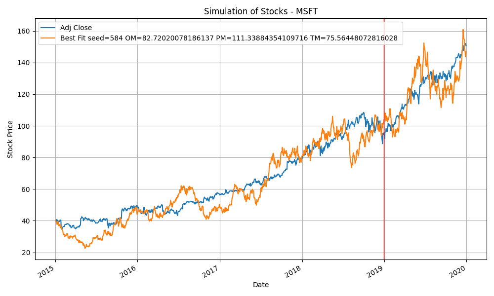

#### Shallow Simulation of Stocks Based on Brownian Motion
Used package website:

Package pyesg: <https://github.com/jason-ash/pyesg>

Package yfinance: <https://github.com/ranaroussi/yfinance> <https://finance.yahoo.com/>

source.py：__主程序__: 

可调参数：
+ generateTime：运行次数
+ ticker：股票代码（yfinance可查）
+ startDate：所需股票开始日期
+ endDate：所需股票结束日期
+ fitTarget：拟合的股票价格种类（开盘价，收盘价...）
+ demoTrain：是否将训练过程生成的曲线绘图
+ demoResult：是否将预测结果绘图
+ trainNum：一次训练生成多少预测路径

img: __运行结果曲线记录__

record.csv: __运行结果记录__

FitS:__详细拟合结果记录__

## 仅将预测MSE小于400的记录

## 结果展示

